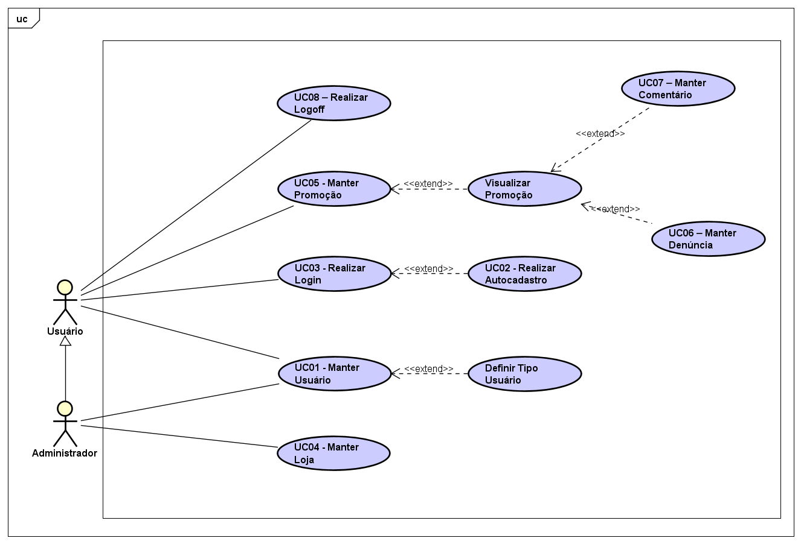

# ADS - Projeto Integrador - PromoCão

Projeto final do curso de Análise e Desenvolvimento de Sistemas, um sistema de agragação de promoções do meio digital.

### Diagrama de Classes:

### Diagrama de Casos de Uso:

### Árvore de objetos do banco de dados Mongo:

Em construção!

